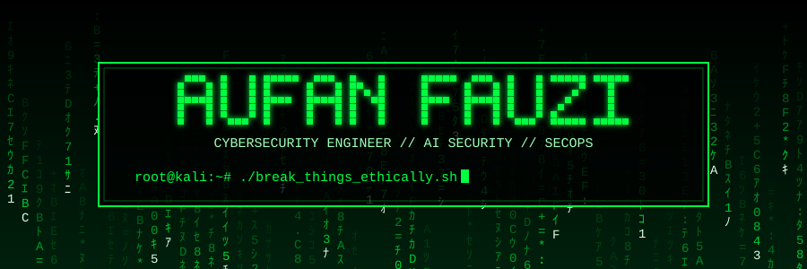
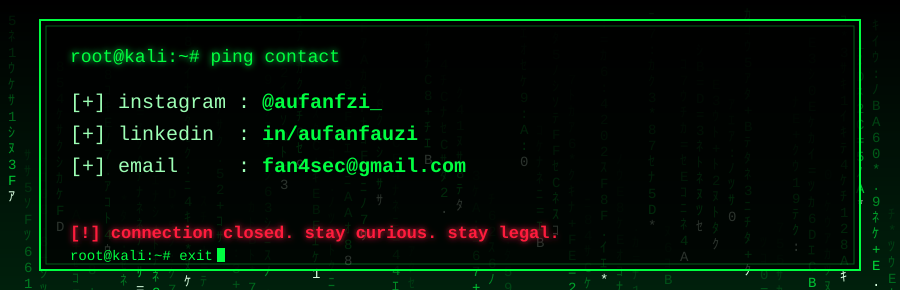

<div align="center">



<a href="https://github.com/aufanfauzi"></a>


</div>

> [!CAUTION]
> **RESTRICTED ZONE.** Semua tools & PoC di sini untuk edukasi dan *authorized testing*. Jangan dipakai ke sistem yang bukan milik lo atau tanpa izin tertulis.

---

## `$ whoami`

```text
┌──(aufan㉿kali)-[~]
└─$ cat about.txt

[+] role       : Cybersecurity Engineer · AI Security Specialist · SecOps Enthusiast
[+] focus      : Cyber Security | AI Security | Security Operations (SecOps)
[+] experience : penetration testing, vulnerability assessment, threat hunting
[+] building   : defensive AI → anomaly detection, log analysis, incident response
[+] learning   : Adversarial ML | LLM Red Teaming | Cloud Security (AWS/GCP)
[+] mission    : bikin sistem yang aman, robust, dan bisa dipercaya — dari endpoint sampai AI model
[+] location   : Tangerang Selatan, Indonesia

┌──(aufan㉿kali)-[~]
└─$ echo $MOTTO
Breaking things ethically, defending systems intelligently, and building secure AI.
```


## `$ ls -la /opt/arsenal`

```text
[OFFENSIVE]   kali · burpsuite · metasploit · nmap · nuclei · sqlmap · wpscan · hydra
[DEFENSIVE]   wireshark · splunk · elk-stack · suricata · snort · fail2ban · ossec
[AI-SEC]      adversarial-ml · llm-security · model-poisoning-detection · isolation-forest · anomaly-detection
[NET/CLOUD]   tcp/ip · dns · http(s) · vpn · firewall · aws · gcp · docker · kubernetes
[CODE]        python · bash · powershell · sql · javascript · go · c
```

<div align="center">


</div>

---

## `$ ./projects --list --status`

| Status | Project | Description | Tech |
|:------:|---------|-------------|------|
| 🟢 `ONLINE` | **AI Anomaly Detector** | Deteksi anomali jaringan pakai Isolation Forest + Z-Score, alert via Telegram | `Python` `Flask` `Telegram` |
| 🟢 `ONLINE` | **OSINT Toolkit** | Recon, subdomain enum, threat intel automation | `Python` `Bash` |
| 🟢 `ONLINE` | **Vulnerability Scanner** | Automated scanner dengan Nuclei + custom templates | `Python` `Nuclei` |

```text
[CLASSIFIED] more projects in the pipeline:
  ├── Autonomous Pentest Agent
  ├── RAG Security Scanner
  ├── MCP Security Tester
  ├── Federated Learning Security
  ├── AI Model Watermarking System
  └── Privacy-Preserving ML
```


<div align="center">



</div>
